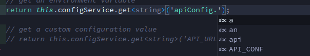
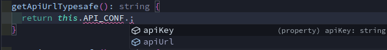

# Type-safe Environment Variables in NestJS Example Project

## 💻 About the Project

I have created some configuration in the `config` folder which will call environment variables from the `.env` file. After that, the configuration is called in the `src/app.service.ts` file with type-safe way.

To make sure this works, I also created unit tests to verify that the `app.service.ts` file returns valid values from the environment variables. To run the unit tests, use:

```bash
npm run test
```

## 🧩 Understanding the Problem

Managing environment variables in a NestJS application can become easier and safer with a type-safe approach. In this repository, I'll explain the common issues encountered when using environment variables directly and how NestJS provides a better solution.


Typically, we use environment variables in code like this:

```javascript
process.env.VARIABLE_NAME
```

Or using NestJS configuration like the image below:



However, this method has a drawback: there is no autocomplete for writing the variable names. This can become problematic if we need to use environment variables in many places, such as when configuring API URLs or API keys across multiple services.

## 🤔 Why Type-safe?

Fortunately, NestJS provides a way to call environment variables in a type-safe manner using namespaces. You can read the official NestJS documentation about configuration here: [NestJS Configuration Documentation](https://docs.nestjs.com/techniques/configuration#configuration-namespaces).

Using namespaces gives us autocomplete when calling the variables, which is very beneficial because it helps avoid typos when using the variables in multiple places.




## ✨ Conclusion

Incorporating type-safe environment variables in your NestJS projects not only improves code readability but also reduces the risk of errors caused by typos. By leveraging the built-in features of NestJS, you can ensure that your application configuration is both robust and maintainable. If you haven't already, I highly recommend giving this approach a try in your next NestJS project.

Thank you for exploring this repository! If you have any questions or feedback, feel free to open an issue or reach out to me.